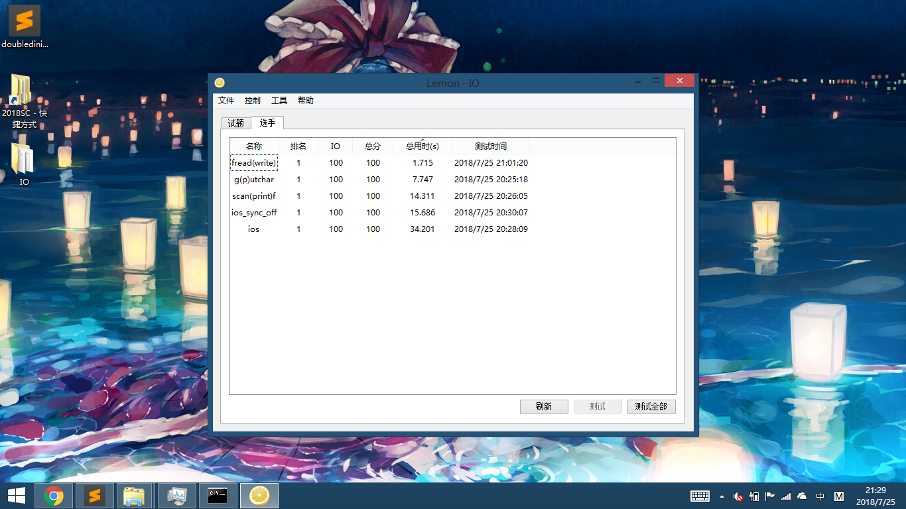

# IO-Test

### 速度之争

众所周知，在 `OI` 中常常有着拥有大量输入输出的题目。

面对这样的题目，输入输出的速度就成了重中之重。

作为剩余时光不多的人，我看着某位同学在 `NOI` 里非常熟练地使用了广为人知的方法输入输出。

然后呢？

……

最终，他因此没能与理想的大学达成契约。

我衷心祝愿大家不再重蹈覆辙。

### 结论

具体的结果[点此](https://htmlpreview.github.io/?https://github.com/Ghastlcon/IO-Test/blob/master/IO/result.html)查看。

### 评测配置

评测机为物理机，具体配置如下

* `Intel® Core™ i5-3320M Processor @ 2.60 GHz`
  * 一级指令缓存: `2 x 32 KB 8-way set associative instruction caches`
  * 一级数据缓存: `2 x 32 KB 8-way set associative data caches`
  * 二级缓存: `2 x 256 KB 8-way set associative caches`
  * 三级缓存：`3 MB 12-way set associative shared cache`
* `8GB DDR3 1600 RAM`
  * 单通道内存
* `INTEL SC2BF180A4L SSD`
* `Windows 8.1 Enterprise`
* `Lenovo Thinkpad X230t`

编译器为 `g++ (x86_64-posix-seh-rev0, Built by MinGW-W64 project) 8.1.0` 。

编译指令为 `g++ IO.cpp -o IO -Wall -Wextra` 。

### 测试方法

具体的测试方法为，给定 `n` 个无符号整数，用空格隔开，需要按顺序输出，用换行符隔开。

第 `i` 个测试点的 `n` 为 `10 ^ (i - 1)` 。共有 `8` 个测试点。

测试点完全由 `gen.cpp` 随机生成，由于测试点过大恕不上传，请自行生成。
